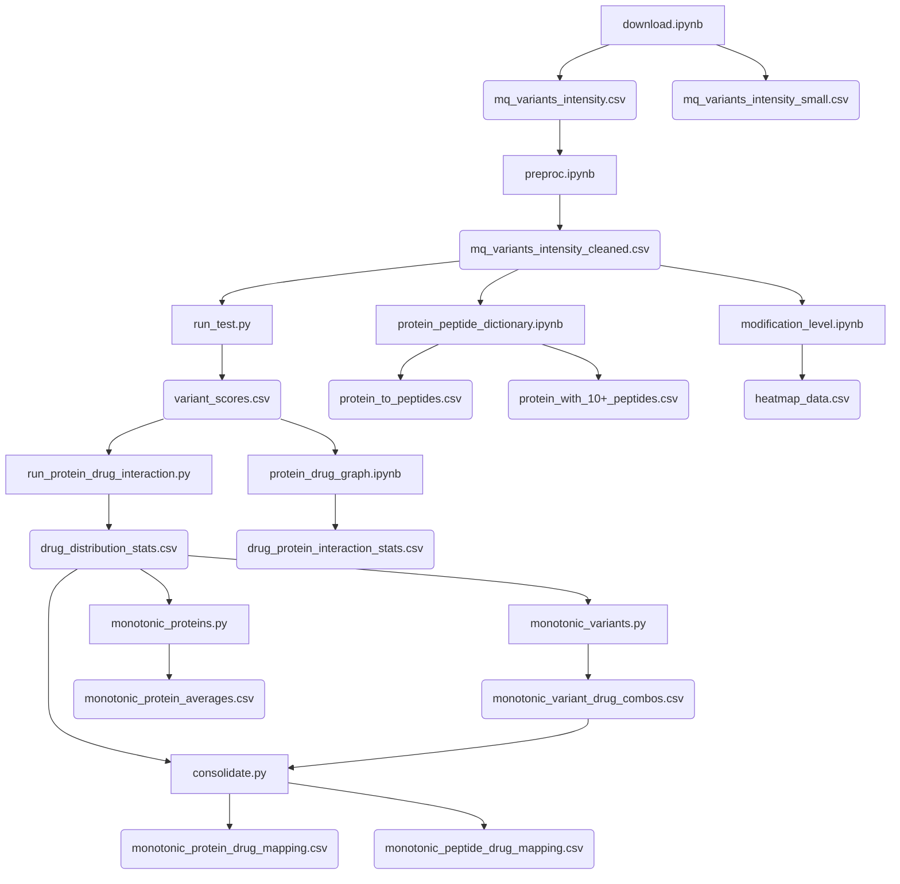

# Proteomics Drug Discovery Project

This repository contains a set of scripts for analyzing peptide/protein responses to drug treatments. The pipeline processes mass spectrometry data to identify significant drug-protein interactions and dose-response relationships.


## Installation

### Install `uv` (Python package manager)
https://docs.astral.sh/uv/getting-started/installation/

If on Mac, install using Homebrew:
```sh
brew install uv
```

### Install dependencies
```sh
# Instead of pip install -r requirements.txt
uv sync
```

### Add a new dependency
```sh
# Instead of pip install <name>
uv add <name>
```

### Remove a dependency
```sh
# Instead of pip uninstall <name>
uv remove <name>
```


## Data Analysis Pipeline

### 1. Download Data
**Script:** `download.ipynb`
- Downloads the proteomics dataset from an external server
- Converts the TSV file to CSV format

### 2. Preprocess Data
**Script:** `preproc.ipynb`
- Cleans and preprocesses the CSV file
- Converts comma-separated numbers to numeric values
- Filters rows with no treatment values
- Performs log2 transformation for fold-change normalization

### 3. Statistical Testing
**Script:** `run_test.py`
- Calculates p-values for each peptide's relative intensity compared to background
- Performs statistical testing to identify significantly affected variants
- Creates distribution and volcano plots for visualization

### 4. Protein-Drug Interaction Analysis
**Script:** `run_protein_drug_interaction.py`
- Compares per-drug background variation distributions for proteins
- Analyzes protein responses to different drugs using Cohen's d effect size
- Generates distribution plots for each drug concentration

### 5. Protein-Peptide Mapping
**Script:** `protein_peptide_dictionary.ipynb`
- Creates a mapping between proteins and their corresponding peptides
- Counts peptides per protein for frequency analysis

### 6. Modification Analysis
**Script:** `modification_level.ipynb`
- Creates a heatmap of top peptide modifications in response to drug treatments
- Ranks modifications by total absolute response

### 7. Protein-Drug Interaction Network
**Script:** `protein_drug_graph.ipynb`
- Analyzes the number of drugs affecting each protein
- Creates distribution plots showing proteins by number of drug effects

### 8. Variant-Level Dose Response
**Script:** `monotonic_variants.py`
- Identifies variants with monotonic intensity changes across drug concentrations
- Finds dose-response relationships at the peptide variant level

### 9. Protein-Level Dose Response
**Script:** `monotonic_proteins.py`
- Checks for monotonic dose-response patterns in protein average intensities
- Identifies consistent protein responses to increasing drug concentrations

### 10. Data Consolidation
**Script**: `consolidate.py`
- Processes protein-drug pairs to identify monotonic dose-response relationships
- Filters pairs based on Spearman correlation strength (|ρ| ≥ 0.7) and sign consistency
- Cross-references filtered protein-drug pairs with peptide-level monotonic data
- Identifies peptide variants that show monotonic behavior even when their parent protein doesn't


## Data Flow Diagram

